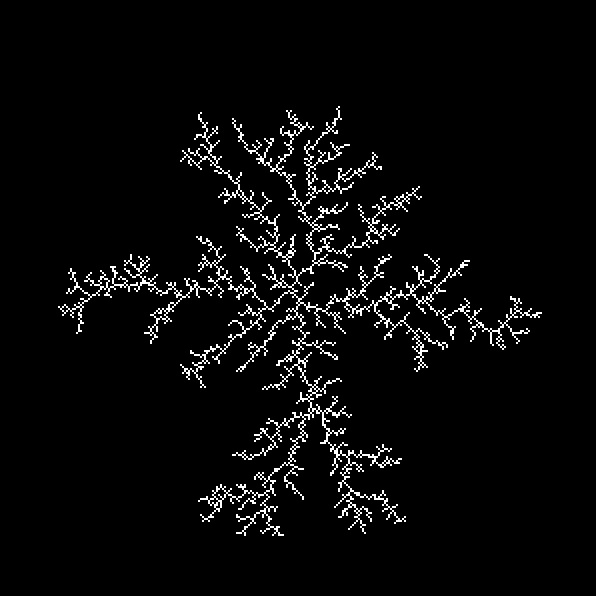
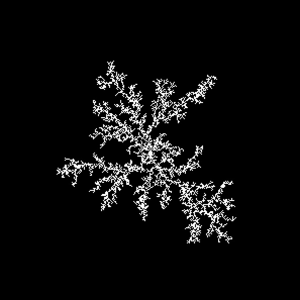
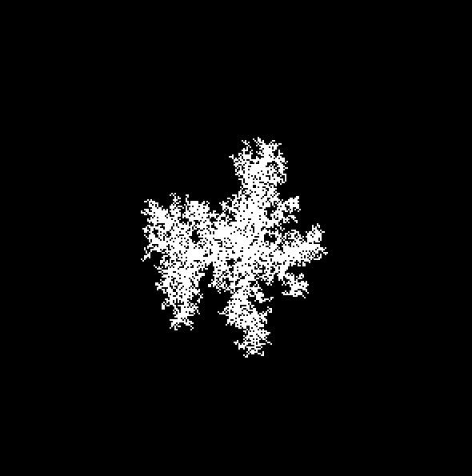
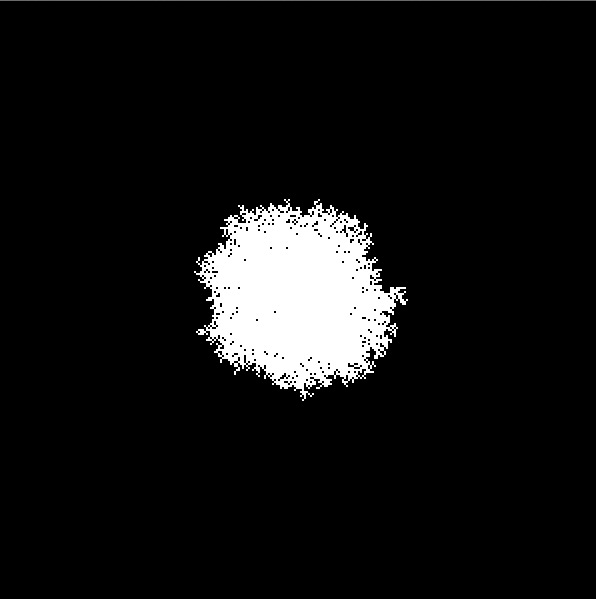
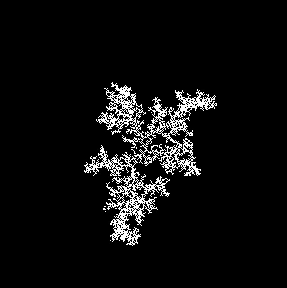
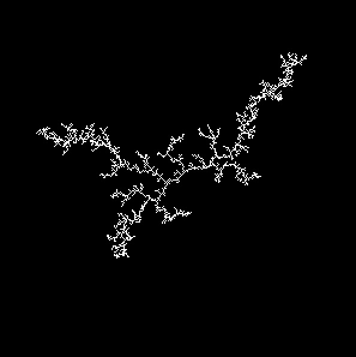

# Project 4: DLA and DBM

#### CS 7492, Spring 2017

#### Due: Saturday, March 18, 2017

## Objective

The goal of this project is to gain experience in creating branching structures, such are found in coral, lichen, and bacterial colonies. You will implement two algorithms for creating branching patterns: diffusion limited aggregation (DLA) and the dielectric breakdown model (DBM). These two algorithms have different computational characteristics, as they select where to add growing materials in different ways. Also, both of these simulation methods have the means to control the thickness of the branches.

## DLA and DBM

In this project, you will implement two different methods of creating branching models. Both of these algorithms create a pattern using a regular grid of squares. They are quite different, however, in how new cells are added to the growing pattern. The Diffusion Limited Aggregation (DLA) algorithm used a random walk to add cells. The Dielectric Breakdown Model (DBM) uses electrostatic potential to select where to grow the pattern. Both grown methods have a tunable parameter that modifies how thin or thick the pattern will be. For DLA, this is the stickiness parameter, which varies from 0 to 1. Stickiness of 1 will create the most skinny patterns. For DBM, this parameter is eta, and it varies from zero to infinity. Valuse of eta near zero give thick patterns, and larger values give more skinny branches.

Here are some requirements of your simulator:

- Create a 2D grid that is at least 200 by 200 cells in size.  (You may want to debug at lower resolution, however.)
- Draw each cell as a uniformly colored square that is 2x2 pixels in size.

Your simulator should act on this set of keyboard commands:

- **space bar** - Start or stop the pattern growth (toggle between these).
- **s,S** - Take one simulation step.
- **1** - From a single seed, run DLA with a sticking factor of 1 (always sticks).
- **2** - From a single seed, run DLA with a sticking factor of 0.1.
- **3** - From a single seed, run DLA with a sticking factor of 0.01.
- **4** - From a single seed, run DBM with eta = 0.
- **5** - From a single seed, run DBM with eta = 3.
- **6** - From a single seed, run DBM with eta = 6.
- **0** - Run DLA with a seed pattern and a sticking factor of your own choosing. Do not just use one seed cell!

**Initialization:**   For almost all of the pre-programmed keys, you will begin the growth pattern with a single "seed" cell in the center of the grid. For keypress zero, you will create initial pattern of cells of your own choosing. Be creative, and be sure to use more than one cell in your initial pattern. Since it is trickier to initialize the DBM algorithm for more than one seed, we are just doing this for the DLA algorithm.

**Drawing the Grid:** In order to display enough cells for a complex branching pattern, you should draw each cell of the grid as just a few pixels. For this reason, I ask that you draw the cells as 2x2 pixels.

**DBM Algorithm:** The DBM algorithm is fairly elaborate. Your resources for this part of the project are your class notes and the paper by Kim et al's paper. Some of the equations discussed below for DBM come from this paper.

Here are example images for DLA, using stickiness parameters of 1, 0.1, and 0.01: 

Here are example images for DBM, using eta parameters of 0, 3, and 6: 

As usual, we will use "Processing" to carry out this assignment:

http://www.processing.org/

For any large project such as this, I recommend backing up your work often. You don't want to put in a ton of work and then accidentally delete all of it. I suggest making a new copy of your entire work folder every hour or so, and giving each new copy a higher number. Don't worry about file sizes -- source files are tiny. I also recommend copying all of your backups to a different computer once each day for extra safety.

## Suggested Approach

As always, you can follow my suggestions or not, depending on your level of confidence about implementing this project.

DLA is the more simple of the two algorithms, so I recommend beginning with this one. The first thing to do is to create a grid data structure, just like the one for the Life cellular automaton. You will want this grid to be integers, not booleans, for later, when you implement DBM. Initialize the grid with a single "seed" cell in the center of the grid. Next, select a random position on the grid at which to start, and start a random walk at that position. You should not store the positions of the random walk in the grid. For debugging purposes, you may want to draw the motion of this point. You can choose any of several options for how to handle the point wandering off the edge of the grid. You can use toroidal wrap, you can "bounce" it back into the grid, or you can start it at a new, random place in the grid. Once you have your random walk working, modify the algorithm to check whether the walk is next to a grid cell that is already occupied. If it is adjacent to an occupied cell, then change the grid point at which the walk is positioned to be occupied, and start a new random walk. When you are at this stage, you have successfully implemented DLA. 

You should next modify your DLA code to randomly choose whether the random walk "sticks" to an occupied cell. Do this by selecting a random number and comparing it to the stickiness factor. A stickiness factor of 1 means the random walk always sticks. 

Next, you should start to tackle DBM. This algorithm still requires a grid, but it also requires that you track two lists of cell positions. For this reason, I recommend creating a "cell" data type that specifies its integer location (i,j), and also a floating point variable for its electrostatic potential. One of the list of cells you should maintain is a list of all cells that have been added to the growning pattern. The second list of cells are the candidate cells, which are those cells that are next to the growing pattern but have not yet been selected to be added to the pattern. You can use the ArrayList data structure to implement these lists. 

You will want to store three possible values in the grid: EMPTY, CANDIDATE, and FILLED. Initialize the grid as EMPTY, except for one FILLED cell in the grid center. Also, create a "cell" data type for this center cell and put it on the growing pattern list. Next, mark the eight cells surrounding this seed as being CANDIDATE, and place eight cells representing these cells on the list of candidate cells. 

At the heart of the DBM algorithm is selecting where to grow the pattern based on the electric potential at the candidate cells. Initially, each candidate cell has a potential that is based on its distance to the one seed cell. You will eventually need to implement two routines that relate to calculating potentials. First, you should implement a routine that calculates the potential at a give cell based on the effects of every cell in the pattern list. This is a matter of calculting the distance from the given cell to each cell in the pattern list, and applying the correct radial basis function (equation 10 in the paper). Next, you should implement an routine that quickly updates the potential of an old candidate cell based on a newly added cell to the pattern. This is based on equation 11 of the paper. 

Once you have the above data structures and routines implemented, you are ready to put together the pieces of the algorithm. Here are the steps needed to grow the pattern by one cell:

* Select a new cell to add to the pattern based on the candidate potentials and a random number. More on this below.
* Place this new cell into the grid, that is, change its state in the grid from CANDIDATE to FILLED. Also, put it on the list of cells in the pattern. Finally, be sure to remove this cell from the list of candidate cells.
* For each cell that was already on the candidate list, update its potential based on equation (11). This should consist of calculating a single basis function based on the candidate and the new cell's positions.
* Decide which cells that are adjacent to the new cell are currently marked as EMPTY. Change them to CANDIDATE, and also place them on the list of candidate cells.
* For each new candidate cell, calculate its potential using equation (10). This requires more computation, since you must sum all of the basis fucntion contributions for each cell that is in the pattern. Fortunately, there are at most five such new candidate cells.
* Go to the first step and repeat.

The last piece of implementing DBM is to select a candidate cell at which to grow the pattern. This is done by calculating a value p_i at each candidate cell based on the potential of a cell. You will need to make several passes over the list of candidate cells to do this. You might also wish to augment your "cell" data type to have additional variables in which to store some of the values that you will calculate (Phi_i_eta, p_i, partial_sum_i). First, calculate the minimum and maximum value over all the potentials of cells in the candidate list. Next, calculate the value Phi_i for each candidate cell based on equation (13), raise it to the power of eta, and store this value (Phi_i_eta) in the data structure for a candidate cell. Distances should be measured in units of pixels, and the value for R_1 should be one. Calculate the sum of all such Phi_i_eta. Now, for each candidate cell, calculate p_i by dividing Phi_i_eta by this sum. Store the value for p_i in each candidate cell. Next, go through the list of candidate cells again, calculating and storing the partial sum of the values p_i up to the i-th cell, and store it in a variable partial_sum_i for the candidate cell. Then, create a random number R in the range of 0 to the partial sum of the last cell in the list (which is actually the sum of all the p_i). Go through the list of candidate cells on last time, and stop at the candidate for which R is less than partial_sum_i. This is the cell that is to be added to the growning pattern. 

**Tips on Debugging DBM:**   Recognize that if eta equals zero, then all the values for p_i are exactly the same, so you are essentially selecting from the candidate cells at random. You can substitute random selection for the more elaborate method of selecting cells based on their potential, and see if you get the same results. Note that each time you add a new cell to the pattern, you should be adding between one and five new candidate cells to the list. Each time you take a simulation step, you can print out how many candidates are being added. As a sanity check, you can also print out the number of cells in the list of pattern cells. This count should grow by one for each step of the algorithm. To debug the math of the candidate cell selection, print the locations and the various values of the candidate cells (potential, Phi_i, etc) for the first two iterations of the simulation. Compare these values to those you calculate by hand. You might also draw the grid cells in different colors to distinguish EMPTY, CANDIDATE, and FILLED. 

## Turning In Your Assignment

Turn in your Processing code for this project on T-square. If your project includes more than one .pde file, zip them together into a single file.

## Authorship Rules

The code that you turn in must be entirely your own. You are allowed to talk to other members of the class and to the teacher about general implementation issues. It is also fine to seek the help of others for general programming questions about Processing. You may not, however, use code that anyone other than yourself has written.  Code that is explicitly not allowed includes code taken from the Web, from books, from previous assignments or from any source other than yourself. You should not show your code to other students. Feel free to seek the help of the teacher for suggestions about debugging your code.
  
